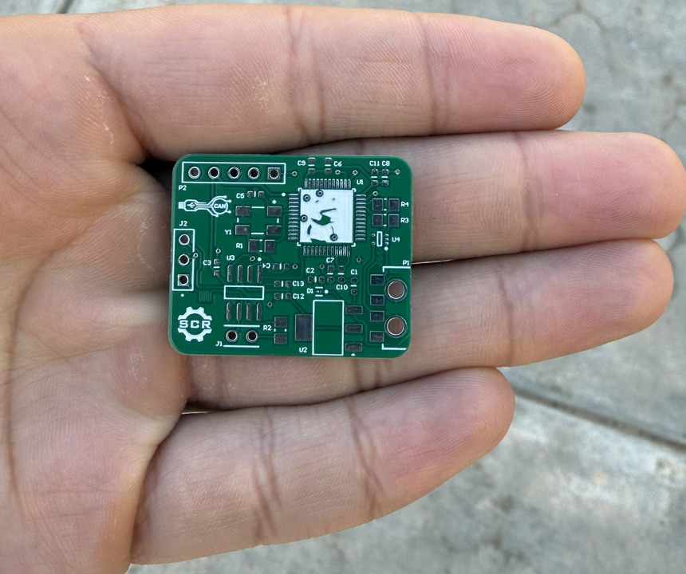
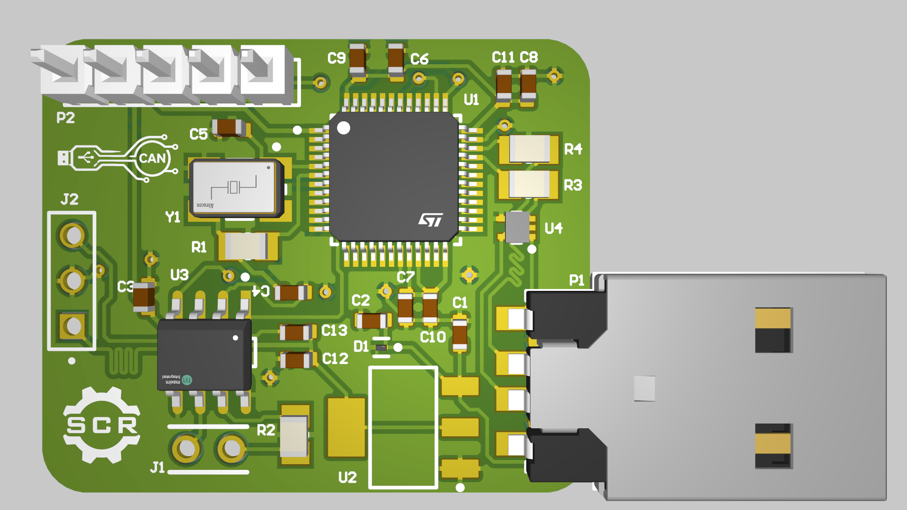

# OpenCAN

A small CAN-to-USB adapter that connects a computer to a CAN bus for live monitoring and development. It plugs straight into a USB-A port and lets you watch bus traffic and reproduce faults instead of guessing.

  
  

## Hardware

- **MCU:** STM32 microcontroller (U1) with an external crystal (Y1)
- **CAN transceiver:** Maxim transceiver (U3) with a 3-pin CAN header (J2)
- **Power:** onboard voltage regulator (U2) fed from USB
- **Host interface:** USB-A plug (P1), plus a 5-pin header (P2)

## Repository layout

| File | Contents |
| --- | --- |
| `Master.SchDoc` | Top-level schematic |
| `Microcontroller.SchDoc` | STM32 and support circuitry |
| `CAN_Transceiver.SchDoc` | CAN transceiver |
| `Voltage_Regulator.SchDoc` | Power supply |
| `Input_Output.SchDoc`, `Output.SchDoc` | Connectors and I/O |
| `CANable.PcbDoc` | PCB layout |
| `CANable.PrjPcb` | Altium project |
| `CANable.zip`, `*.Cam` | Fabrication outputs |

Designed in Altium Designer.
