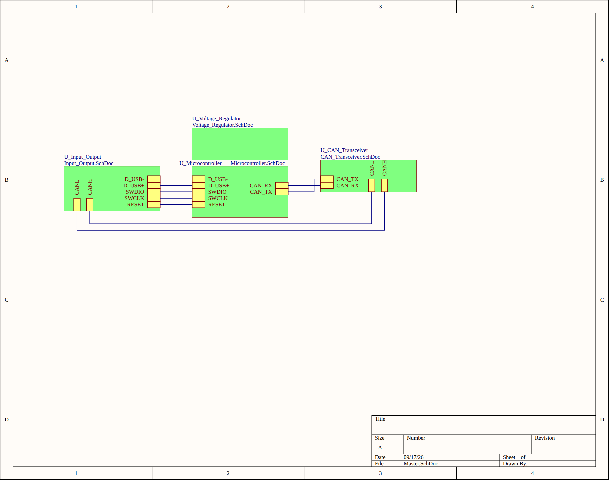
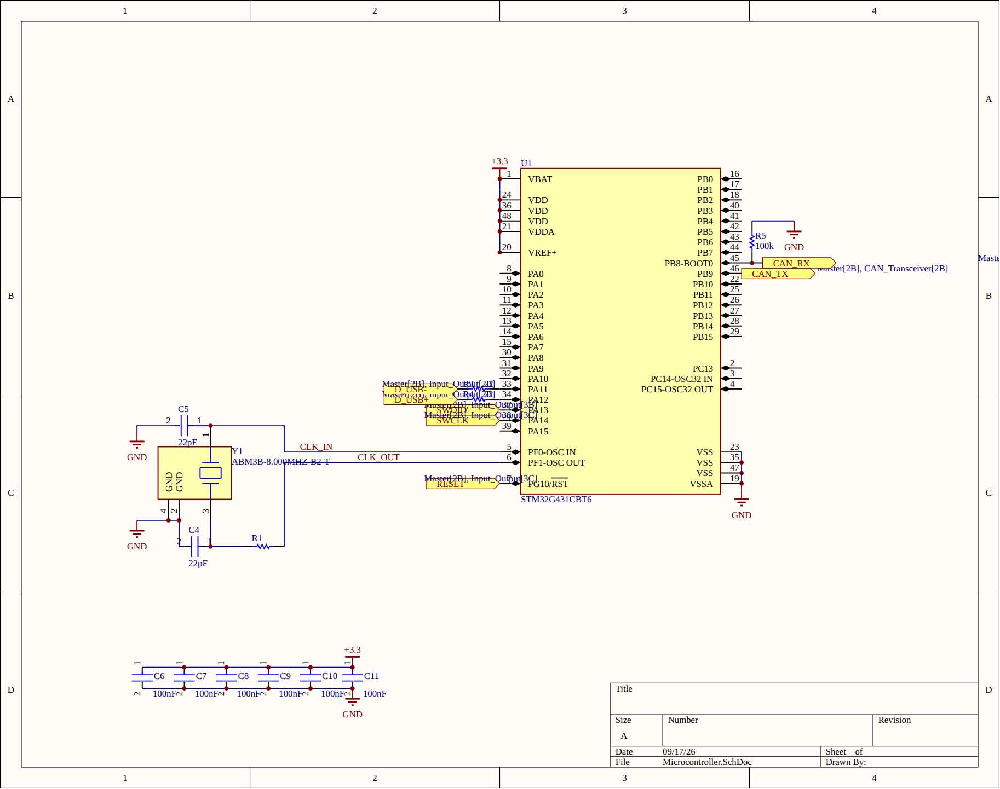
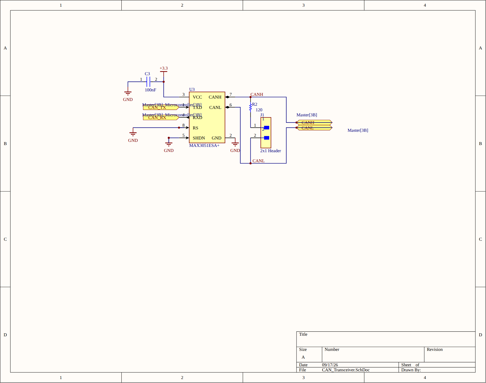
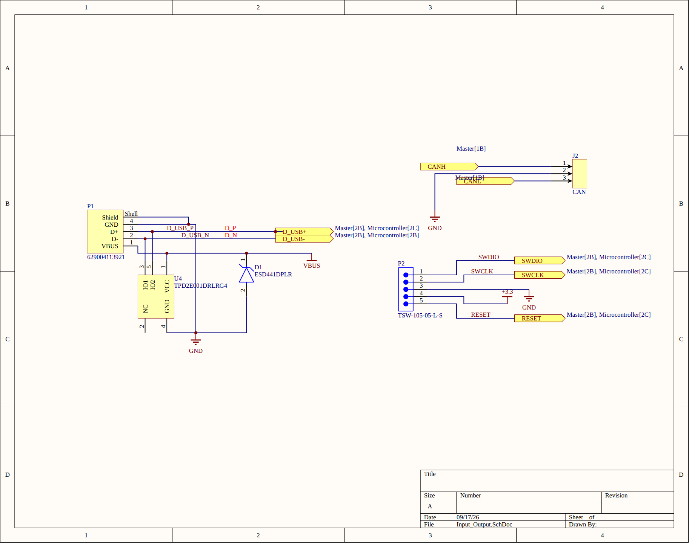
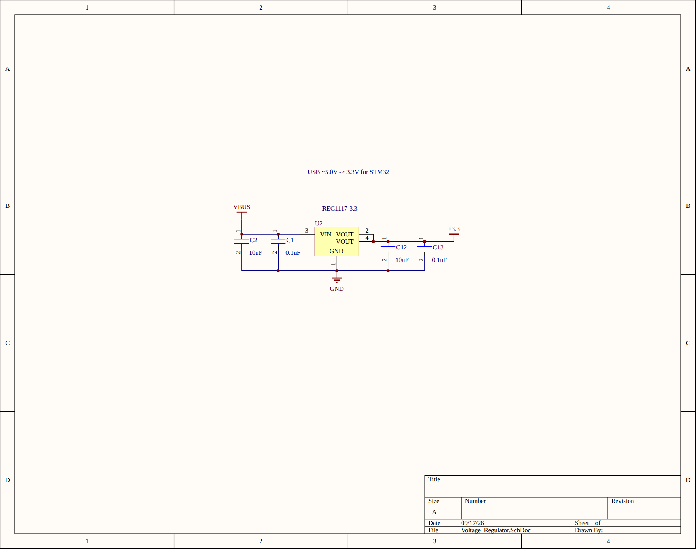

# OpenCAN

A small CAN-to-USB adapter that connects a computer to a CAN bus for live monitoring and development. It plugs straight into a USB-A port and lets you watch bus traffic and reproduce faults instead of guessing.

  
  

## Hardware

- **MCU:** STM32G431CBT6 (U1) with an 8 MHz crystal (Y1)
- **CAN transceiver:** MAX3051ESA+ (U3), with a jumper-selectable 120 Ω termination resistor (J1/R2) and a 3-pin CAN header (J2)
- **Power:** REG1117-3.3 LDO (U2), USB 5 V to 3.3 V
- **USB:** USB-A plug (P1) with TPD2E001 ESD protection on D+/D- (U4) and a TVS diode on VBUS (D1)
- **Debug:** 5-pin SWD header (P2): SWDIO, SWCLK, 3.3 V, GND, RESET

## Schematic

The design is hierarchical: a top-level sheet ties together the USB/IO, microcontroller, CAN transceiver, and power sheets.

**Top level**

**Microcontroller**

**CAN transceiver**

**USB, CAN connector, and SWD header**

**Voltage regulator**

## Repository layout

| File | Contents |
| --- | --- |
| `Master.SchDoc` | Top-level schematic |
| `Microcontroller.SchDoc` | STM32 and support circuitry |
| `CAN_Transceiver.SchDoc` | CAN transceiver |
| `Voltage_Regulator.SchDoc` | Power supply |
| `Input_Output.SchDoc`, `Output.SchDoc` | Connectors and I/O |
| `CANable.PcbDoc` | PCB layout |
| `CANable.PrjPcb` | Altium project |
| `CANable.zip`, `*.Cam` | Fabrication outputs |

Designed in Altium Designer.
